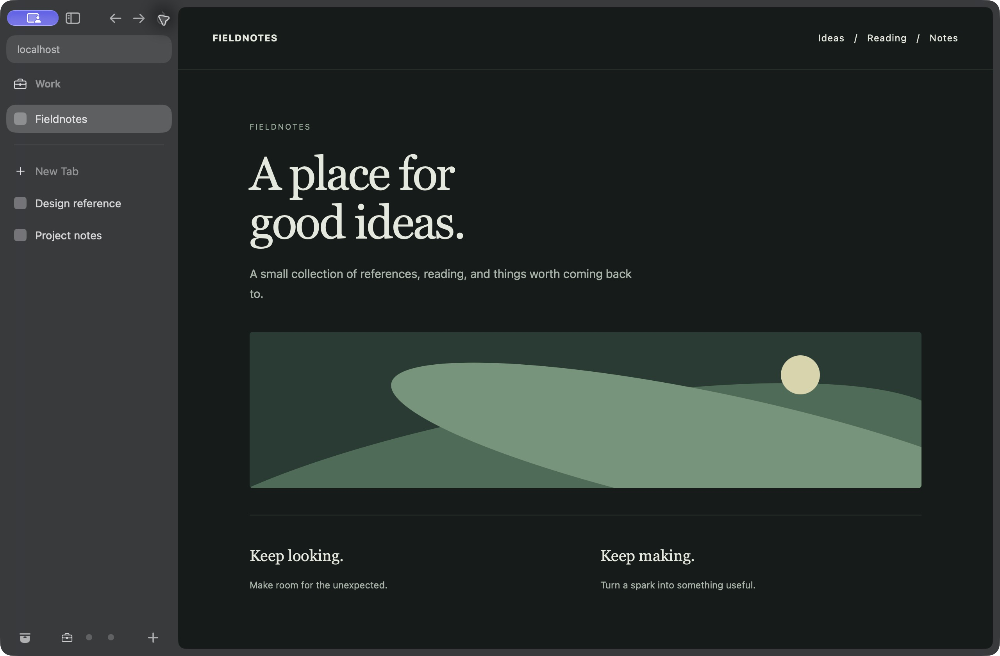

# Vane

Vane is a native macOS browser built with Swift, SwiftUI, AppKit, and WebKit.
Apple’s `WKWebView` renders pages; Vane adds sidebar tabs, Spaces, profiles,
reading tools, and browser controls around it.

**Requires macOS 26 or later.** Vane is in active development. Read the
[limitations](#limitations) before relying on it as your only browser.

Read the [privacy policy](PRIVACY.md) for local storage, network requests,
optional services, and data controls. It is also available on the
[website](https://notnaki.github.io/vane/privacy.html).

## Download and install

1. Open the [latest GitHub release](https://github.com/notnaki/vane/releases/latest)
   and read its notes and known issues.
2. Download `Vane.dmg`, open it, and drag Vane to Applications.
3. Open Vane from Applications. The first-run welcome is skippable.

Published releases are built through the signing and notarization workflow.
That does not establish compatibility with every site or complete clean-Mac
installation/upgrade coverage. See [release validation](docs/RELEASING.md).

Use **Vane → Check for Updates…** to check manually. The updater offers stable
releases; tags containing a hyphen are prereleases and are not offered.
Merging to `main` does not publish a release.

Stable release bundles packaged with a Developer ID offer the default-browser
prompt once. Local, debug, and prerelease builds skip it. The manual
**Make Vane Default…** action remains available in Settings.

## Build and run

Use macOS 26 or later and Xcode 26 or later with its included Swift toolchain.
From a checkout:

```sh
git clone https://github.com/notnaki/vane.git
cd vane
./make-app.sh
open Vane.app
```

`make-app.sh` builds the release executable, assembles the app and its helpers,
adds resources and icons, and signs the bundle ad hoc for local development.
Use `./make-app.sh debug` for a faster development build.

To build the executable and run checks that need no Keychain or window server:

```sh
swift build -c release
./.build/release/vane selfcheck --pure
```

Use the assembled app for bundled icons and native sandbox/signing behavior.
Xcode 27 plus macOS 27 is needed for Vane-managed location decisions; the minimum
runtime remains macOS 26. See [development setup](docs/DEVELOPMENT.md#setup-and-local-builds)
and [release procedures](docs/RELEASING.md) for testing and distribution.

## Feature overview

| Area | What is implemented |
| --- | --- |
| Browsing | Sidebar tabs, Favourites, pinned tabs, folders, multiple windows, private windows, Split View, Peek, and Little Vane. |
| Organization | Spaces, reusable Space templates, Tidy Tabs with review/undo, bulk tab organization, bookmarks, history search, and Library. |
| Reading | Reader preferences, an offline article queue, find on page, and page capture. |
| Media | Custom Picture in Picture, a minimized sidebar player, and embedded-player controls with native PiP fallback. |
| Visual tools | Easels with notes, drawing, captures, live web views, and editable JSON or PNG export; per-site Boosts for styles, Zap, and opt-in scripts. |
| Data | Separate profiles, local Keychain passwords and account chooser, browser imports, exports, complete library backups, and local recovery points. |
| Controls | Custom search engines and site-search shortcuts, keyboard bindings, themes, app icons, Battery Saver, and site controls. |
| Integrations | Unpacked WebExtensions, EasyList-subset blocking and HTTPS subscriptions, GitHub Live Folders, and optional AI providers using your own keys. |

“Implemented” describes available behavior. Verification is scoped to the
revision, macOS version, signing, and fixture or service recorded in each audit.
It is not a guarantee of general website or extension compatibility.

## Start browsing

- **⌘T** opens search for a new tab; **⌘L** opens the address bar.
- **Shift+Return** uses Instant Links to open a DuckDuckGo first result, regardless of your selected search engine. [Details and exceptions](docs/BROWSING.md#search-and-history).
- **⇧⌘T** reopens a closed tab; **⌘F** finds text on the page.
- **⇧⌘L** opens Library; **⌘Y** opens History.
- Click a Space button or swipe horizontally over the sidebar to switch Spaces.
- Use **F6** / **⇧F6** to move between the page and browser controls.

Shortcuts can be changed in Settings; the menu bar shows current bindings.
[Everyday browsing](docs/BROWSING.md) explains tab organization, shared windows,
site search, keyboard navigation, downloads, and media.



The [screenshot notes](docs/media/README.md) describe the isolated demo captures.

## Documentation

The [documentation index](docs/README.md) is the starting point for guides,
troubleshooting, specialist audits, and recorded validation.

| Guide | Covers |
| --- | --- |
| [Everyday browsing](docs/BROWSING.md) | Tabs, Spaces, windows, search, shortcuts, Library, downloads, and media. |
| [Reading and customization](docs/FEATURES.md) | Reader, offline articles, Easels, capture, Boosts, templates, appearance, and Battery Saver. |
| [Profiles, data, and privacy](docs/DATA-AND-PRIVACY.md) | Passwords, imports/exports, website data, backups, folder locks, and recovery boundaries. |
| [Extensions and integrations](docs/INTEGRATIONS.md) | Extension consent/diagnostics, content blocking, permissions, AI keys, and GitHub Live Folders. |
| [Development](docs/DEVELOPMENT.md) | Setup, CLI, focused tests, graphical smoke checks, project structure, and contribution workflow. |
| [Releases and distribution](docs/RELEASING.md) | Publishing, signing/notarization, updater checks, and candidate validation. |

The [website field guide](https://notnaki.github.io/vane/docs.html) provides a
visual introduction. The Markdown guides above contain detailed current controls
and caveats; the website keeps its existing layout and navigation.

## Limitations

Vane uses the system WebKit engine. Support depends on the installed macOS and
WebKit version, the website, and sometimes signing or Apple-managed capabilities.

- **Compatibility is incomplete.** Scoped macOS 27 public-demo and local-fixture
  passes do not establish provider sign-ins, subscription streaming, cross-network
  calls, all hardware permissions, or minimum-macOS/notarized-candidate coverage.
  See the [compatibility matrix](docs/REAL-SITE-COMPATIBILITY.md).
- **Passkeys are pending** Apple managed browser entitlement approval, matching
  provisioning, and registration/sign-in validation. Developer ID alone is insufficient.
- **Folder uploads are blocked on macOS 27.0.x** because a standalone WebKit probe
  reproduced a guard fault before submission. Ordinary files remain available;
  directory submission on other versions is unverified. See the matrix’s
  [directory investigation](docs/REAL-SITE-COMPATIBILITY.md#directory-form-root-cause-investigation--2026-10-08).
- **Passwords and extensions have compatibility limits.** Autofill is heuristic;
  unpacked MV2/MV3 support does not guarantee Chrome Web Store or arbitrary API support.
- **Blocking supports part of EasyList.** Unsupported rules are reported; local
  disk lists do not update automatically. URL subscriptions do.
- **Data does not sync between Macs.** Backups are unencrypted and exclude Keychain
  secrets, cookies/site storage, downloaded files, and external extension code.
  General browser imports exclude sessions; the dedicated Arc flow supports some.
- **Live drafts are not recoverable backups.** Suspension protects detected or
  uncertain drafts, but crashes, page closure, or locking can lose volatile work.
  [Draft protection](docs/DRAFT-PROTECTION.md) and [crash recovery](docs/CRASH-RECOVERY.md)
  describe what is preserved and what cannot be restored.
- **Permissions and reliability remain bounded.** Embedded device requests fail
  closed; location controls require Xcode/macOS 27; screen sharing stays managed by
  WebKit/macOS. Resume, physical storage failure, and every navigation failure are
  not guaranteed by synthetic checks.
- **Some features use private WebKit APIs**, including inspector integration and
  a guarded page-shutdown fallback, which can change with macOS releases.

Detailed evidence lives in the [audit index](docs/README.md#reliability-and-validation).
[Browser readiness](docs/BROWSER-READINESS-TODO.md) separates completed work from
remaining validation and engineering tasks. A real notarized candidate and
clean-Mac install/upgrade checks are still required for distribution claims.

## Contributing

Follow [AGENTS.md](AGENTS.md) for isolated branches, relevant validation,
independent PR review, required CI, and squash-merging. Use focused local checks
for the affected behavior; documentation changes do not need the full app suite.

Report issues with the macOS version, Vane version, steps, and expected behavior
in the [issue tracker](https://github.com/notnaki/vane/issues). Avoid including
passwords, tokens, personal browsing data, or private documents in reports.

## License

Vane is released under the MIT License. See [LICENSE](LICENSE).
Bundled font attribution and licenses are in
[Sources/Vane/EaselFonts](Sources/Vane/EaselFonts/SOURCE.md).
